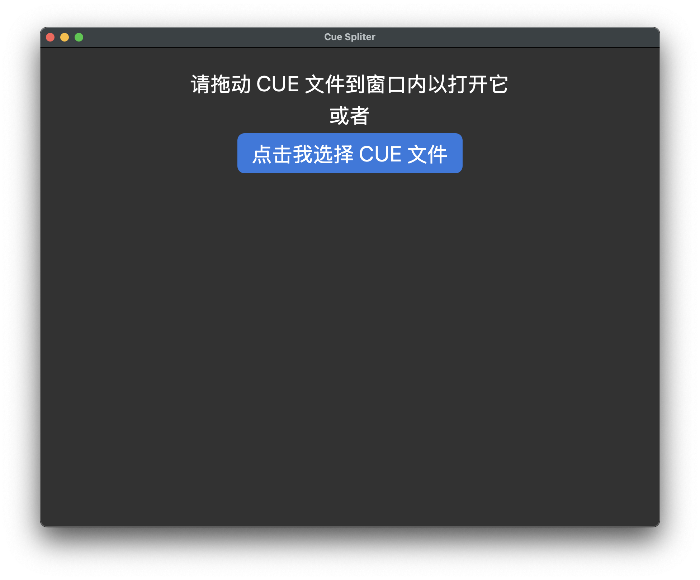
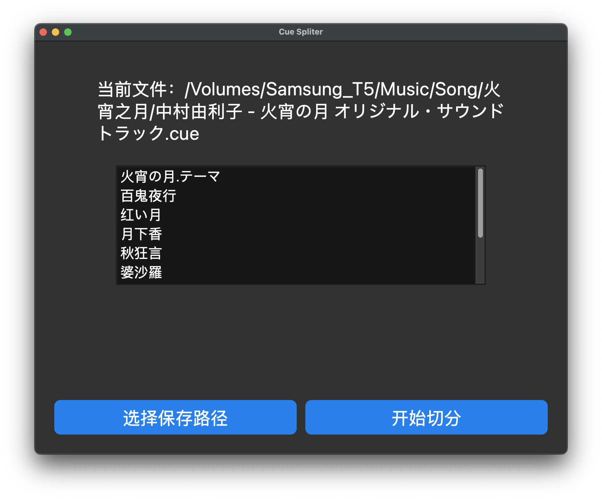
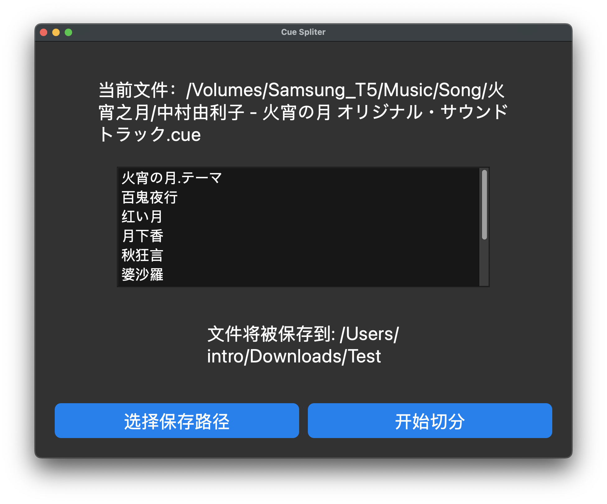
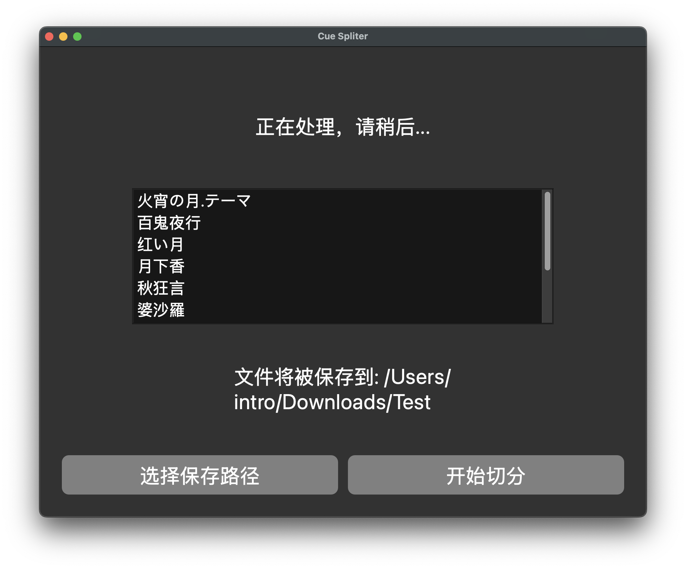
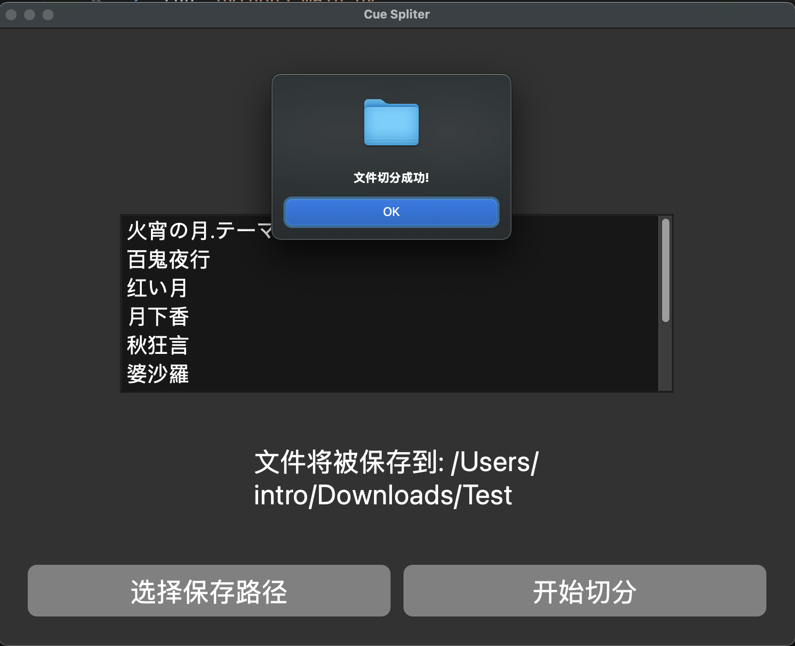

# CUE 文件切分

## 运行方式

1. run `pip3 install -r requirements.txt`
2. run `python3 main.py`

## 使用方式

运行后可以看到主页:

    

如窗口内提示所述，你可以拖动 CUE 文件到窗口，或者点击按钮选择一个 CUE 文件。

如果是一个可以识别的 CUE 文件，则会列出该 CUE 下包含的歌曲，你可以滑动滚轮来查看歌曲信息

    

如果想要更换一个 CUE 文件，则拖动那个 CUE 文件到窗口内即可。

初始状态是没有设置保存（导出）路径的，需要点击按钮来选择一个文件夹，成功选择后如下图所示：

    

之后就可以点击按钮进行切分了。注意切分过程中需要等待一段时间，此时界面无法进行交互：

    

等待窗口提示 "文件切分完成" 完成即可：

    

切分成功后会自动弹出目录页面。

# Thanks

1. FFcuesplitter: https://github.com/jeanslack/FFcuesplitter
2. PyQt 6
