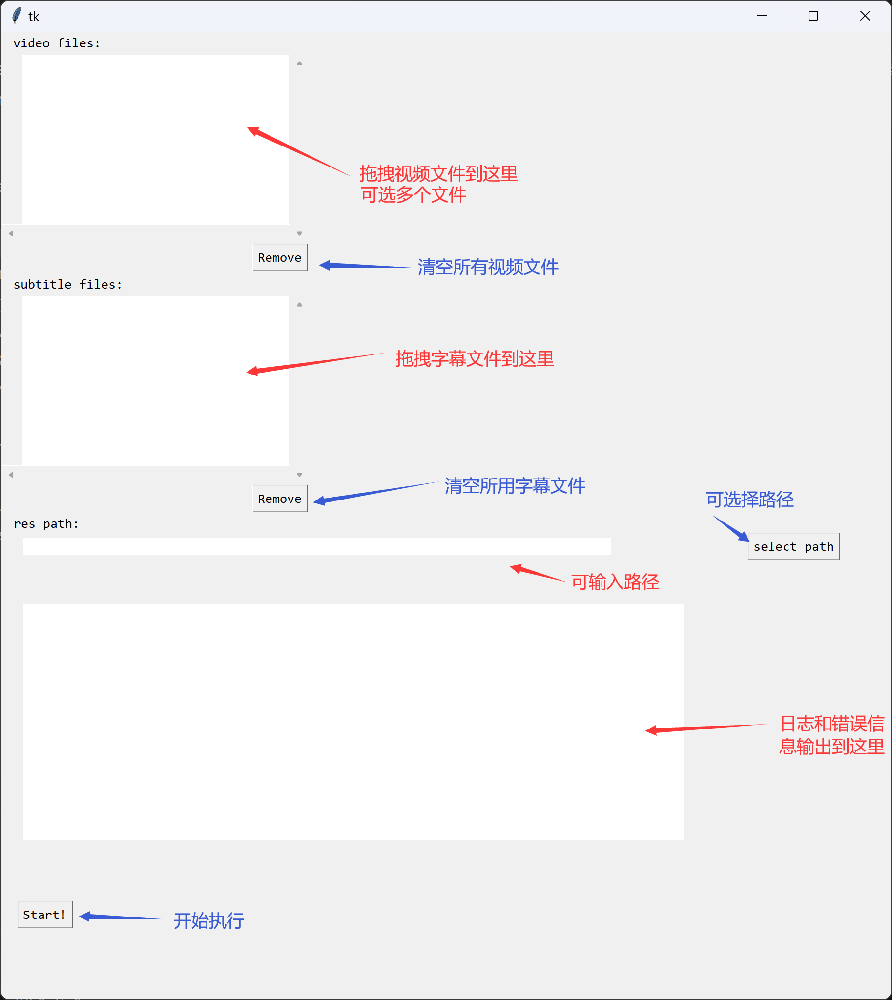

## 给视频添加字幕
### 已知问题
目前只是一个可用状态，用起来并不舒服
1. 目前支持 windows 和 macOS（后续有时间支持 linux
2. 路径名包含繁体时拖拽到 box 内会乱码
3. 没有 stop 按钮（后续有时间添加
4. 窗口内没有 scrollbar，需通过放大窗口看到 UI，UI 位置固定
5. 需要手动编译（后续有时间支持
6. 开始后无法 stop（除非关闭进程
7. 输出日志仅黑色
### 依赖
- 依赖库
    - python3
    - ffmpeg：command line 能找到就行，安装方法自行搜索
    - tkinter，TkinterDnD2：安装使用参考 https://stackoverflow.com/questions/25427347/how-to-install-and-use-tkdnd-with-python-tkinter-on-osx
### 用法：
```shell
python combine_video_subtitles.py
```



